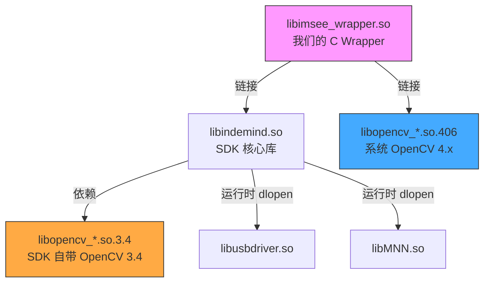
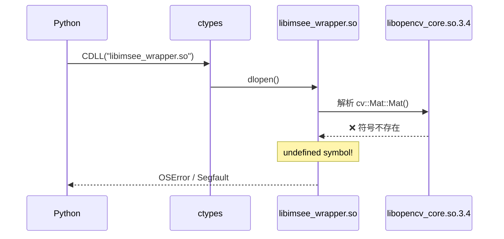
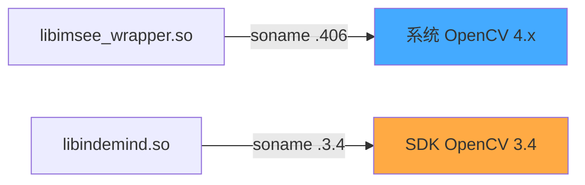
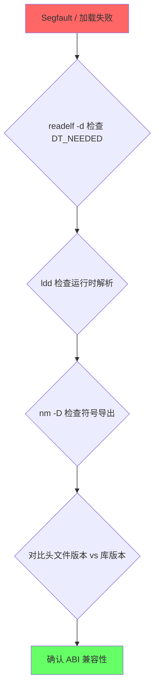

# 开发报告：OpenCV 双版本 ABI 冲突导致 Segfault 的排查与修复

> **项目**: Indemind OV580 Linux Python Wrapper
> **日期**: 2026-02-16
> **严重程度**: 致命（Segfault，进程崩溃）
> **状态**: 已修复

---

## 一、问题描述

将 IMSEE-SDK 的 12 个 C++ Demo 移植为 Python 脚本后，通过 `test/imsee_sdk.py` 调用 `sdk.init()` 时发生 **Segmentation Fault**。

奇怪的是：
- 最小化测试（只声明 `init` 和 `release` 两个函数）→ **正常**
- 完整 wrapper（声明全部 28 个函数后再调用 `init`）→ **崩溃**

这让排查方向一度偏向 ctypes 的 argtypes 声明问题，实际上是**链接层面**的 ABI 冲突。

---

## 二、技术背景

### 2.1 依赖关系



### 2.2 关键差异

| 特征 | OpenCV 3.4 (SDK 自带) | OpenCV 4.x (系统) |
|------|----------------------|-------------------|
| soname | `libopencv_core.so.3.4` | `libopencv_core.so.406` |
| `cv::Mat::Mat()` | **内联**（头文件中定义） | **导出符号**（.so 中） |
| `cv::Mat::~Mat()` | **内联** | **导出符号** |
| `cv::Mat::empty()` | **内联** | **导出符号** |
| 位于 | `lib/` 目录 | `/lib/x86_64-linux-gnu/` |

---

## 三、根因分析

### 3.1 链接顺序错误

原始 `build.sh` 编译命令：

```bash
g++ -shared -fPIC -O2 \
    -o lib/libimsee_wrapper.so \
    src/imsee_wrapper.cpp \
    -I include \
    -L lib -lindemind \              # ← -L lib 在前！
    -Wl,-rpath,'$ORIGIN' \
    $(pkg-config --cflags --libs opencv4) \  # ← opencv 的 -l 在后
    -lpthread
```

**问题**：`pkg-config --libs opencv4` 输出的是 `-lopencv_core -lopencv_imgproc ...`（不含 `-L` 路径）。链接器在处理这些 `-l` 标志时，搜索路径中唯一的 `-L` 是 `lib/`，于是：

```
-lopencv_core → 搜索 lib/ → 找到 libopencv_core.so (→ 3.4) → 链接 3.4 ✗
```

### 3.2 符号不匹配

编译时用的是 **OpenCV 4.x 头文件**（`/usr/include/opencv4/`），其中 `cv::Mat` 的构造函数等被声明为**非内联**。编译器生成了对外部符号的引用：

```
U cv::Mat::Mat()           ← 需要从 .so 中解析
U cv::Mat::~Mat()
U cv::Mat::empty() const
U cv::Mat::convertTo(...)
U cv::cvtColor(...)
```

但链接的是 **OpenCV 3.4 的 .so**，这些符号在 3.4 中是内联的，**不导出**：

```bash
$ nm -D lib/libopencv_core.so.3.4 | grep "MatC1Ev"
# 空！3.4 不导出 cv::Mat::Mat()
```

### 3.3 运行时表现



### 3.4 为什么最小化测试能通过？

最小化测试使用的 `libimsee_minimal.so` **不链接任何 OpenCV**。它只调用 SDK 的 `Init()` 和 `Release()`，回调函数只接收 `unsigned char*`（不涉及 `cv::Mat`）。因此不存在 OpenCV 符号问题。

---

## 四、修复方案

### 4.1 build.sh 修复：链接顺序

```bash
# 修复后：系统 OpenCV 库路径在 lib/ 之前
SYSLIB="/lib/x86_64-linux-gnu"
g++ -shared -fPIC -O2 \
    -o lib/libimsee_wrapper.so \
    src/imsee_wrapper.cpp \
    -I include \
    $(pkg-config --cflags opencv4) \
    -L "$SYSLIB" -lopencv_imgproc -lopencv_core \   # ← 系统 4.x 在前
    -L lib -lindemind \                               # ← SDK 在后
    -Wl,-rpath,'$ORIGIN' \
    -lpthread
```

修复后的 DT_NEEDED：

```
libopencv_imgproc.so.406  ← 系统 4.x ✓
libopencv_core.so.406     ← 系统 4.x ✓
libindemind.so            ← SDK ✓
```

两个 OpenCV 版本通过不同的 **soname** 共存，互不干扰：



### 4.2 imsee_sdk.py 修复：预加载依赖

```python
def _preload_deps():
    """预加载系统库和 SDK 依赖 (RTLD_GLOBAL)"""
    # 1. 系统 libgcc/libstdc++ 优先（覆盖 conda 旧版本）
    for sl in ("/lib/x86_64-linux-gnu/libgcc_s.so.1",
               "/lib/x86_64-linux-gnu/libstdc++.so.6"):
        if os.path.exists(sl):
            try: ctypes.CDLL(sl, mode=ctypes.RTLD_GLOBAL)
            except: pass

    # 2. SDK 运行时 dlopen 依赖
    for dep in ("libusbdriver.so", "libMNN.so", "libindemind.so"):
        p = os.path.join(_LIB_DIR, dep)
        if os.path.exists(p):
            try: ctypes.CDLL(p, mode=ctypes.RTLD_GLOBAL)
            except: pass
```

这解决了两个额外问题：
- **Conda ABI 冲突**：Conda 的旧 `libgcc_s.so.1` 缺少 `GCC_12.0.0` 版本符号
- **运行时 dlopen**：`libindemind.so` 在运行时 `dlopen("libusbdriver.so")`，需要 `LD_LIBRARY_PATH` 或预加载

---

## 五、排查过程中的弯路

| 排查方向 | 花费时间 | 结论 |
|----------|----------|------|
| ctypes argtypes 声明错误 | 长 | ❌ 所有声明与 C 签名完全匹配 |
| 静态全局变量 ABI | 中 | ⚠️ 有风险但非根因（已改为指针） |
| `-std=c++14` 编译标志 | 中 | ❌ 非根因，已恢复默认 |
| USB 设备权限 (udev) | 短 | ✅ 真实问题，但不是 segfault 的原因 |
| Conda libgcc 冲突 | 中 | ✅ 真实问题，通过预加载解决 |
| **OpenCV 双版本冲突** | **长** | ✅ **根因！链接顺序导致** |

---

## 六、经验教训

### 教训 1：链接顺序至关重要

> **`-L` 路径的顺序决定了链接器找到哪个版本的库。**

当项目目录中存在与系统同名的库时（如 `libopencv_core.so`），`-L lib` 的位置必须在系统路径之后，否则链接器会找错版本。

### 教训 2：编译时头文件 ≠ 运行时库

> **头文件决定了编译器生成什么符号引用，库决定了运行时能否解析这些引用。**

OpenCV 4.x 头文件将 `cv::Mat::Mat()` 声明为非内联 → 编译器生成外部引用 → 但链接的 3.4 库不导出该符号 → 运行时崩溃。

### 教训 3：soname 是共存的关键

> **不同 soname 的共享库可以同时加载，各自解析各自的依赖。**

`libopencv_core.so.406` 和 `libopencv_core.so.3.4` 是两个独立的库。只要 DT_NEEDED 正确指向对应版本，就能和平共存。

### 教训 4：最小化测试可能遗漏依赖问题

> **最小化测试通过不代表完整版没问题。**

`libimsee_minimal.so`（无 OpenCV）通过测试，但 `libimsee_wrapper.so`（有 OpenCV）崩溃。差异在于依赖链，而非代码逻辑。

### 教训 5：排查共享库问题的标准流程



推荐命令：

```bash
# 查看 .so 需要哪些库
readelf -d lib/libimsee_wrapper.so | grep NEEDED

# 查看运行时能否找到所有依赖
LD_LIBRARY_PATH=lib ldd lib/libimsee_wrapper.so

# 查看 .so 中未定义的符号
nm -D lib/libimsee_wrapper.so -u | c++filt | grep cv::

# 查看某个库导出了哪些符号
nm -D lib/libopencv_core.so.3.4 | grep "Mat"
```

---

## 七、最终验证

```
Init: 0
Module: ID: M1, FW: 1.0
Depth enabled: 0
Disparity enabled: 0
IMU enabled: 0
Frame: (400, 1280)      ← 立体图像正常
Depth: (400, 640)        ← 深度图正常，范围 508-28437mm
Disparity: (400, 640)    ← 视差图正常
IMU: (2000, 7)           ← IMU 数据正常，重力 ≈ [0, 0, 1.0]g
Calibration baseline: 0.12m
DONE - clean exit
```

全部功能正常，无 segfault，资源正确释放。
