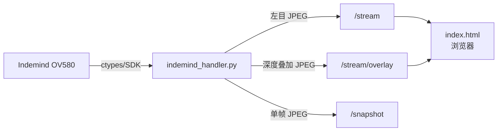
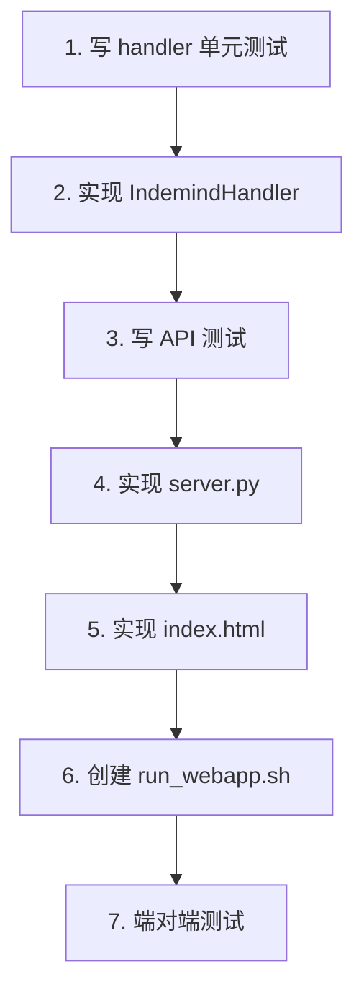

# RPD: Indemind 双目深度相机 Webapp MVP（独立版）

> **版本**: v0.2
> **日期**: 2026-02-16
> **状态**: 已批准

---

## 一、目标

在 vio-playground 项目中构建一个**独立的 webapp**，通过浏览器实时查看 Indemind OV580 的**左目画面**和**彩色深度叠加画面**。

验证技术可行后，后续再整合到 Teno-Core。

## 二、技术栈

与 Teno-Core 保持一致，方便后续移植：

| 层 | 技术 |
|----|------|
| 后端 | **FastAPI** + Uvicorn |
| 流媒体 | **MJPEG** over HTTP (multipart/x-mixed-replace) |
| 相机接口 | **ctypes** → ImseeSdk (已有) |
| 图像处理 | **OpenCV** + NumPy |
| 前端 | **纯 HTML/JS**（MVP 不引入 Vue 构建，一个 HTML 文件够用） |

> **前端说明**: MVP 用单个 `index.html`（原生 JS + fetch），不需要 Node/Vite/Vue 构建。
> 整合到 Teno-Core 时再改为 Vue 组件，HTML → Vue 的迁移成本极低。

## 三、MVP 范围

### 3.1 做什么



- 后端：`webapp/server.py`（FastAPI）+ `webapp/indemind_handler.py`
- 前端：`webapp/static/index.html`（一个 HTML 文件）
- 启动：`./run_webapp.sh` → 浏览器打开 `http://localhost:8080`

### 3.2 不做什么

- Vue/Vite 前端构建
- 右目画面、视差、点云、IMU
- 录制、WebRTC
- 与 Teno-Core 的任何集成

## 四、技术设计

### 4.1 目录结构

```
vio-playground/
├── webapp/
│   ├── server.py               # FastAPI 主入口
│   ├── indemind_handler.py     # 相机管理 + JPEG 生成
│   └── static/
│       └── index.html          # 前端页面
├── webapp_tests/
│   ├── test_indemind_handler.py
│   └── test_server.py
├── run_webapp.sh               # 一键启动
├── test/
│   └── imsee_sdk.py            # 已有 SDK wrapper（复用）
└── ...
```

### 4.2 后端：IndemindHandler

```python
class IndemindHandler:
    def __init__(self, lib_dir: str)
    def start(self) -> dict          # {"success": bool, "error": str|None}
    def stop(self) -> dict
    def is_running(self) -> bool
    def get_frame_jpeg(self, quality=80) -> bytes | None
    def get_overlay_jpeg(self, quality=80) -> bytes | None
    def get_status(self) -> dict     # {"running", "fps", "resolution", "alpha"}
    def set_alpha(self, alpha: float)

    # 内部
    @staticmethod
    def depth_to_color(depth_mm, max_range=4000) -> tuple[np.ndarray, np.ndarray, np.ndarray]
```

### 4.3 后端：API 端点

| 端点 | 方法 | 返回 | 说明 |
|------|------|------|------|
| `/` | GET | HTML | 前端页面 |
| `/stream` | GET | MJPEG | 左目实时流 |
| `/stream/overlay` | GET | MJPEG | 深度叠加实时流 |
| `/snapshot` | GET | JPEG | 单帧快照 |
| `/api/status` | GET | JSON | 相机状态 |
| `/api/start` | POST | JSON | 启动相机 |
| `/api/stop` | POST | JSON | 停止相机 |
| `/api/config` | POST | JSON | 设置参数 (alpha) |

### 4.4 前端：index.html

```
┌──────────────────────────────────────┐
│  Indemind OV580 深度相机 Viewer       │
│                                      │
│  ┌───────────────┐ ┌──────────────┐ │
│  │   左目画面     │ │  深度叠加     │ │
│  │   /stream     │ │  /stream/    │ │
│  │               │ │  overlay     │ │
│  └───────────────┘ └──────────────┘ │
│                                      │
│  状态: ● 已连接  FPS: 25  640x400   │
│  [启动] [停止]  透明度: [====░] 50% │
└──────────────────────────────────────┘
```

- 两个 `` 标签直接指向 MJPEG 端点
- 状态栏每 2 秒轮询 `/api/status`
- 按钮通过 `fetch()` 调用 `/api/start`、`/api/stop`、`/api/config`

### 4.5 启动脚本

```bash
#!/bin/bash
# run_webapp.sh
export LD_LIBRARY_PATH="/lib/x86_64-linux-gnu:$SCRIPT_DIR/lib"
export _IMSEE_LIB_OK=1
python3 -m uvicorn webapp.server:app --host 0.0.0.0 --port 8080
```

## 五、TDD 测试计划

### 5.1 后端单元测试 (`webapp_tests/test_indemind_handler.py`)

**纯逻辑测试（不需要相机）**:

| 测试 | 验证点 |
|------|--------|
| `test_handler_init` | 创建成功，`is_running() == False` |
| `test_handler_stop_without_start` | 不崩溃 |
| `test_handler_double_stop` | 不崩溃 |
| `test_get_frame_not_running` | 返回 `None` |
| `test_get_overlay_not_running` | 返回 `None` |
| `test_get_status_not_running` | 返回 `{"running": False, ...}` |
| `test_set_alpha_clamp` | alpha 被限制在 0.0-1.0 范围 |
| `test_depth_to_color_shape` | 输入 (H,W) uint16 → 输出 (H,W,3) uint8 |
| `test_depth_to_color_zeros` | 全零输入 → 全黑输出 |
| `test_depth_to_color_near_red` | 近距离 (500mm) → 红色通道高 |
| `test_depth_to_color_far_blue` | 远距离 (3500mm) → 蓝色通道高 |

**需要相机的测试（标记 `@pytest.mark.camera`）**:

| 测试 | 验证点 |
|------|--------|
| `test_start_with_camera` | `start()` 成功，`is_running() == True` |
| `test_get_frame_jpeg_magic` | 返回的 bytes 以 `\xff\xd8` 开头 |
| `test_get_overlay_jpeg_magic` | 同上 |
| `test_start_stop_cycle` | 启动 → 获取帧 → 停止 → 无泄漏 |

### 5.2 API 测试 (`webapp_tests/test_server.py`)

使用 `httpx.AsyncClient` + FastAPI `TestClient`，mock handler：

| 测试 | 验证点 |
|------|--------|
| `test_index_html` | `GET /` 返回 200 + `text/html` |
| `test_status_endpoint` | `GET /api/status` 返回 200 + JSON |
| `test_start_endpoint` | `POST /api/start` 返回 JSON |
| `test_stop_endpoint` | `POST /api/stop` 返回 JSON |
| `test_config_alpha` | `POST /api/config {"alpha": 0.7}` 返回成功 |
| `test_snapshot_not_running` | `GET /snapshot` 返回 503 |
| `test_stream_content_type` | `GET /stream` 返回 `multipart/x-mixed-replace` |

## 六、实施步骤



### 文件清单

| 操作 | 文件 |
|------|------|
| **新建** | `webapp/indemind_handler.py` |
| **新建** | `webapp/server.py` |
| **新建** | `webapp/static/index.html` |
| **新建** | `webapp_tests/test_indemind_handler.py` |
| **新建** | `webapp_tests/test_server.py` |
| **新建** | `run_webapp.sh` |

### 依赖安装

```bash
pip install fastapi uvicorn
```

## 七、后续：迁移到 Teno-Core

MVP 验证后，迁移步骤：

1. `indemind_handler.py` → `Teno-Core/webapp/indemind_handler.py`（直接复制）
2. API 端点 → `Teno-Core/webapp/routes/indemind.py`（从 server.py 提取）
3. `index.html` → `IndemindView.vue`（改为 Vue 组件，复用 CameraStream.vue）
4. `server.py` 加一行 `include_router`
